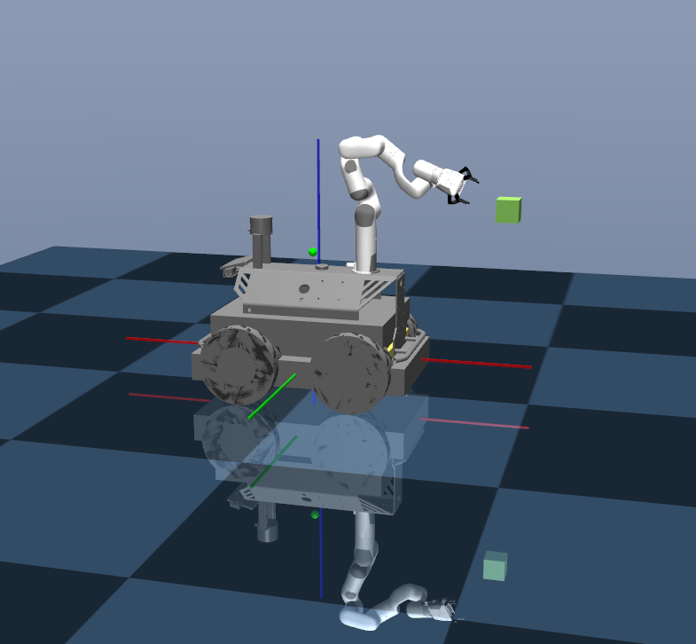

# Mobile Manipulator Whole Body Control for Efficient Dynamic Grasping for a Random Trajectory Object conditioned on Reachability
Code release for the xx 2023 paper:
## Dependency
* Ubuntu==20.04.5 LTS
* conda==22.9.0
* python==3.7.13
* gymnasium==0.26.3 (gymnasium-robotics install시 같이 자동 다운됨)
* stable-baselines3==1.6.2
* mujoco==2.2.2 (gymnasium-robotics install시 같이 자동 다운됨)
* mujoco_py=2.1.2.14
* torch==1.12.0
* torchvision==0.13.0
## Comment
파일 다운하시고, 
```
$ cd
$ cd .mujoco/mujoco210/bin/
$ ./simulate
```
해서 mujoco simulator 실행 후 
```
dynamic_grasping.xml
```
파일을 simulator에 끌어다 놓으면 model 확인할 수 있습니다.

오른쪽에 joint property를 조정해 mobile manipulator를 움직여 볼 수 있습니다.

</img>

---
gym 중요파일의 대략적인 실행 구조
```python
$ import gym
$ env = gym.make('Walker2d-v4')
```
```
Execute sequence (Exited from last number)
1, core.py - Env
2, envs/registration.py - EnvSpec
3, envs/registration.py - make
4, envs/mujoco/waler2d_v4.py - Walker2DEnv
5, envs/mujoco/mujoco_env.py - MujocoEnv
6, envs/mujoco/mujoco_env.py - BaseMujocoEnv
```
- 5,6 번은 mujoco와 직접 연동되어서 mujoco로 계산된 데이터(action)를 전달하고, 변화된 상황(next state)을 반환하는 기능을 한다. 
- 3 번은 5,6,을 wrapping 하는 class로 5,6의 데이터를 이용해 step, get_obs등의 main() 에서 사용될만한 것들을 core.py 의 Env 형태로 정의하고 있다.
- 2 번은 자료형 정리
- 1 번은 기본 틀만 있고 함수 내부는 구현되지 않았다. 아마 4번에서 구현된것이 그대로 사용되는 wrapper class 역할을 하고 있는 것 같다. 

우리는 MujocoEnv or MujocopyEnv 둘 중 하나를 선택해 사용하고, BaseMujocoEnv 까지는 그대로 사용해야 될 것 같다
내 생각대로라면 4번만 혹은 1,4 번만 배껴서 새로 만들면 될 것 같다. 

문제점: 
- BaseMujocoEnv를 보면 python을 이용해 mujoco model의 joint에 달린 모터의 torque, position, ... 을 보내는 것 같다. 그러나 현재 우리 xml 파일에는 end-effector를 제외한 나머지 joint에 motor가 달려있지 않다. 
기존의 panda 로봇 제어하는 논문에서 그사람들은 joint control을 안하고 EE position control 만 사용해서 motor가 필요 없었던 것 같다. 위 논문과 같은 방식을 사용하기에는 real-world application 에서 별로일 것 같다. 
결국, 각 joint 마다 motor를 달아야 한다. (토나오네)
- 기존 panda는 MujocopyEnv를 사용하는데 공식 gym 은 MujocoEnv를 사용한다. 이는 import를 mujoco or mujoco_py 중 뭘쓰냐의 차이 인데 나는 당연히 MujocopyEnv써야되는것 같은데 gym 은 따른걸 썼으니까 gym 처럼 MujocoEnv를 써야 할까? 근데 중요한건 분명 현재 import mujoco 는 되는데 내부 메서드를 쓸수가 없다. 뭔가 패키지가 잘못된 것 같다. 뭐 그렇게 둘 간의 큰 차이는 없어보이니까 MujocopyEnv써보는 걸로 먼저 해봐야 겠다.
- 내 생각에는 위 실행 순서가 (2 > 3 > 1 > 4 > 5 > 6 or 3 > 2 > 1 > 4 > 5 > 6) 이 되야 될 것 같은데 왜저런지 모르겠다.

## Installation


## Usage

## Citation